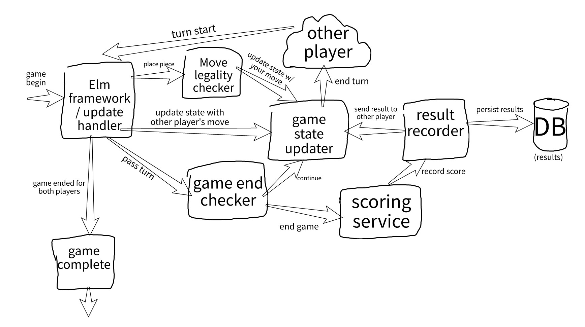

# net-go

The game Go over the internet. Inspired by the Hikaru no-Go manga.

This project is divided into a Go backend and an Elm frontend.
Dev setup steps/requirements can be found in READMEs under
the corresponding directories.

You can launch the dev server by running `npm start`.

Telemetry aggregation via [hyperdx](https://www.hyperdx.io/chart).

## Basic game architecture

## Built with thanks to the following tools

* [Gin web framework](https://gin-gonic.com/)
* [Elm language/platform/everything](https://elm-lang.org/)
* [MariaDB](https://mariadb.com/)

## Acknowledgements

* [rtfeldman](https://github.com/rtfeldman/) for their project [elm-spa-example](https://github.com/rtfeldman/elm-spa-example), from which I stole many ideas
